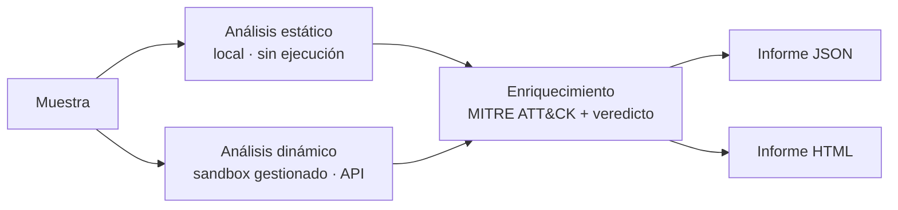

# malpipe

[](https://github.com/BlueShield-Ch4rl13/Malpipe/actions/workflows/ci.yml)
[](LICENSE)


**Pipeline automatizado de análisis de malware — estático + dinámico — con informe y mapeo MITRE ATT&CK.**

`malpipe` toma una muestra, la analiza sin ejecutarla (estático) y, opcionalmente, la detona en un **sandbox gestionado** para obtener comportamiento real (dinámico). Cruza ambas fuentes, mapea la actividad a **MITRE ATT&CK** y genera un informe en **JSON** (para ingesta en SIEM / The Hive) y **HTML** (para revisión del analista).

> Herramienta **defensiva** de DFIR / análisis de malware. Analiza muestras; no las crea.

---

## Arquitectura

El diseño separa lo seguro de lo peligroso: el estático corre **en local**; la detonación real se delega a un **sandbox gestionado por API**, de modo que la muestra **nunca se ejecuta en tu máquina**.



**Estático (local, seguro):** hashes (MD5/SHA1/SHA256, imphash, ssdeep opcional), parseo de cabecera PE (secciones, entropía, imports, imports sospechosos), extracción de strings e IOCs (IPs, dominios, URLs, emails) y escaneo YARA.

**Dinámico (sandbox gestionado):** envía la muestra a [tria.ge](https://tria.ge) (o VirusTotal), espera el informe y extrae puntuación, familia y firmas de comportamiento.

**Enriquecimiento:** mapeo heurístico a técnicas ATT&CK desde los imports (estático) y las firmas (dinámico), más una puntuación agregada 0–100 y un veredicto (`limpio` / `sospechoso` / `malicioso`).

---

## Instalación

```bash
git clone https://github.com/BlueShield-Ch4rl13/Malpipe.git
cd Malpipe
pip install -r requirements.txt      # núcleo: pefile + requests
```

Opcional (mejor análisis): `pip install yara-python` para reglas YARA y `pip install ssdeep` (requiere `libfuzzy-dev`) para fuzzy hashing.

## Uso

```bash
# Solo estático (no necesita claves)
python -m malpipe muestra.exe --no-dynamic

# Estático + dinámico (requiere clave de sandbox, ver abajo)
python -m malpipe muestra.exe -o reports/

# Un directorio entero de muestras
python -m malpipe ./samples/ -o reports/
```

Cada análisis genera `reports/<sha256>.json` y `reports/<sha256>.html`.

### Con Docker (recomendado para la VM)

```bash
cp .env.example .env          # rellena TRIAGE_API_KEY
mkdir -p samples reports
docker compose run --rm malpipe /samples -o /reports
```

## Configuración

Las claves se leen de variables de entorno (copia `.env.example` a `.env`, que está en `.gitignore`):

| Variable | Descripción |
|---|---|
| `TRIAGE_API_KEY` | Clave de API de tria.ge — habilita el análisis dinámico |
| `VT_API_KEY` | Clave de VirusTotal (alternativa) |
| `MALPIPE_DYNAMIC_TIMEOUT` | Segundos de espera del informe del sandbox (300 por defecto) |
| `MALPIPE_YARA_DIR` | Carpeta de reglas YARA (`rules/` por defecto) |

Sin clave de sandbox, el pipeline avisa y ejecuta **solo estático**.

---

## Portal web (analiza desde el navegador)

Un frontend para que **cualquiera, sin perfil técnico, suba un fichero y reciba un veredicto** (malicioso / sospechoso / limpio) con todo lo descubierto. Sirve el mismo motor `malpipe` a través de una API.

```bash
pip install -r requirements.txt -r requirements-web.txt
uvicorn webapp.server:app --host 0.0.0.0 --port 8000    #  ->  http://localhost:8000
# o con Docker:
docker compose up web
```

**No es estático.** A diferencia de un dashboard servido por Cloudflare Pages, el portal necesita un backend siempre encendido, porque tiene que recibir la subida, **guardar la clave del sandbox en secreto** (nunca en el navegador) y llamar al sandbox bajo demanda. El fichero se analiza **en memoria y no se guarda** en disco.

### API

| Endpoint | Descripción |
|---|---|
| `POST /api/analyze` | Sube un fichero → crea un trabajo, devuelve `job_id` |
| `GET /api/result/{job_id}` | Estado + informe (el estático llega al momento; el dinámico, cuando el sandbox termina) |
| `GET /api/config` | Config pública para el frontend (sitekey de Turnstile, tamaño máximo) |

### Despliegue público con Cloudflare Tunnel (recomendado)

Para exponerlo **sin abrir puertos** de tu servidor y con protección delante:

```bash
cloudflared tunnel --url http://localhost:8000
# y apunta un subdominio (p.ej. analiza.carlosvillalbalagos.com) al túnel
```

Delante, Cloudflare te da TLS, WAF y rate-limiting. Enlázalo desde `cti.carlosvillalbalagos.com` con un botón.

### Guardarraíles de un servicio público

Un endpoint público que acepta ficheros de cualquiera exige cuidado. Lo que ya trae y lo que debes activar:

- **Nunca ejecuta en tu equipo** — la detonación ocurre en el sandbox gestionado.
- **No persiste ficheros** — se analizan en memoria y se descartan.
- **Rate-limit por IP** integrado (`MALPIPE_RATE_MAX` / `MALPIPE_RATE_WINDOW`) y **límite de tamaño** (`MALPIPE_MAX_UPLOAD_MB`).
- **Anti-bots** — activa Cloudflare Turnstile poniendo `TURNSTILE_SITEKEY` y `TURNSTILE_SECRET` (ya lo usas en tu web). Sin esto, cualquiera puede automatizar subidas.
- **Coste/cuota** — cada análisis dinámico consume cuota de tu API de sandbox. Con Turnstile + rate-limit lo tienes acotado; añade un tope diario si lo abres del todo.
- **Contenido** — un formulario público de subida puede recibir contenido ilícito. Añade un aviso legal, no almacenes nada y apóyate en el manejo del propio sandbox.

Variables (todas opcionales, ver `.env.example`): `MALPIPE_MAX_UPLOAD_MB` (30), `MALPIPE_RATE_MAX` (5), `MALPIPE_RATE_WINDOW` (600), `TURNSTILE_SITEKEY`, `TURNSTILE_SECRET`.

---

## ⚠️ Seguridad y "producción"

**Analizar malware requiere aislamiento.** Por eso el análisis dinámico se delega a un **sandbox gestionado**: la muestra se detona en su infraestructura, no en la tuya. Ejecutar `malpipe` en tu VM es seguro porque la VM **no ejecuta la muestra**.

Reglas de la casa:
- Manipula muestras **solo dentro de una VM dedicada**, con snapshot y **sin acceso a tu red de confianza**.
- Las muestras y las salidas del sandbox **quedan fuera del repositorio** (ya están en `.gitignore`).
- Nunca subas muestras reales a un repo público.

**Evolución — detonación local con CAPEv2:** si más adelante quieres detonar en tu propia infraestructura (sin depender de un sandbox externo), el camino es un **CAPEv2** en un **host físico aislado y dedicado** (no esta misma VM): virtualización anidada, red simulada con INetSim/FakeNet y segmentación estricta. Sería un módulo nuevo en `malpipe/dynamic/` con la misma interfaz `(filename, data) -> DynamicResult`, y **no** debe compartir host con nada de valor.

---

## Estructura

```
malpipe/
├── malpipe/          # motor
│   ├── static/       # hashes, PE, strings/IOCs, YARA
│   ├── dynamic/      # sandbox gestionado (tria.ge)
│   ├── enrich/       # mapeo ATT&CK + veredicto
│   ├── report/       # informes JSON y HTML
│   ├── pipeline.py   # orquestador
│   └── __main__.py   # CLI
├── webapp/           # portal web
│   ├── server.py     # API FastAPI + servido del frontend
│   ├── jobs.py       # trabajos en segundo plano
│   └── static/       # frontend (HTML/CSS/JS)
├── rules/            # reglas YARA
├── tests/
├── Dockerfile · docker-compose.yml
└── pyproject.toml
```

## Roadmap

- [ ] Motor de detonación local CAPEv2 (host aislado)
- [ ] Extracción de configuración de familias conocidas
- [ ] Export de IOCs a formato STIX / MISP
- [ ] Integración con [News CTI](https://cti.carlosvillalbalagos.com) para contrastar IOCs

## Licencia

MIT © 2026 CVL
